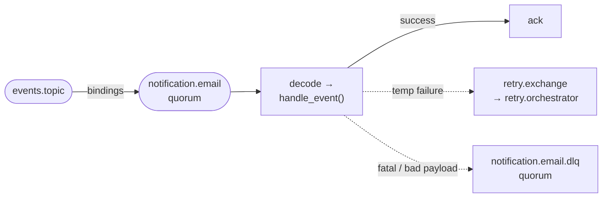
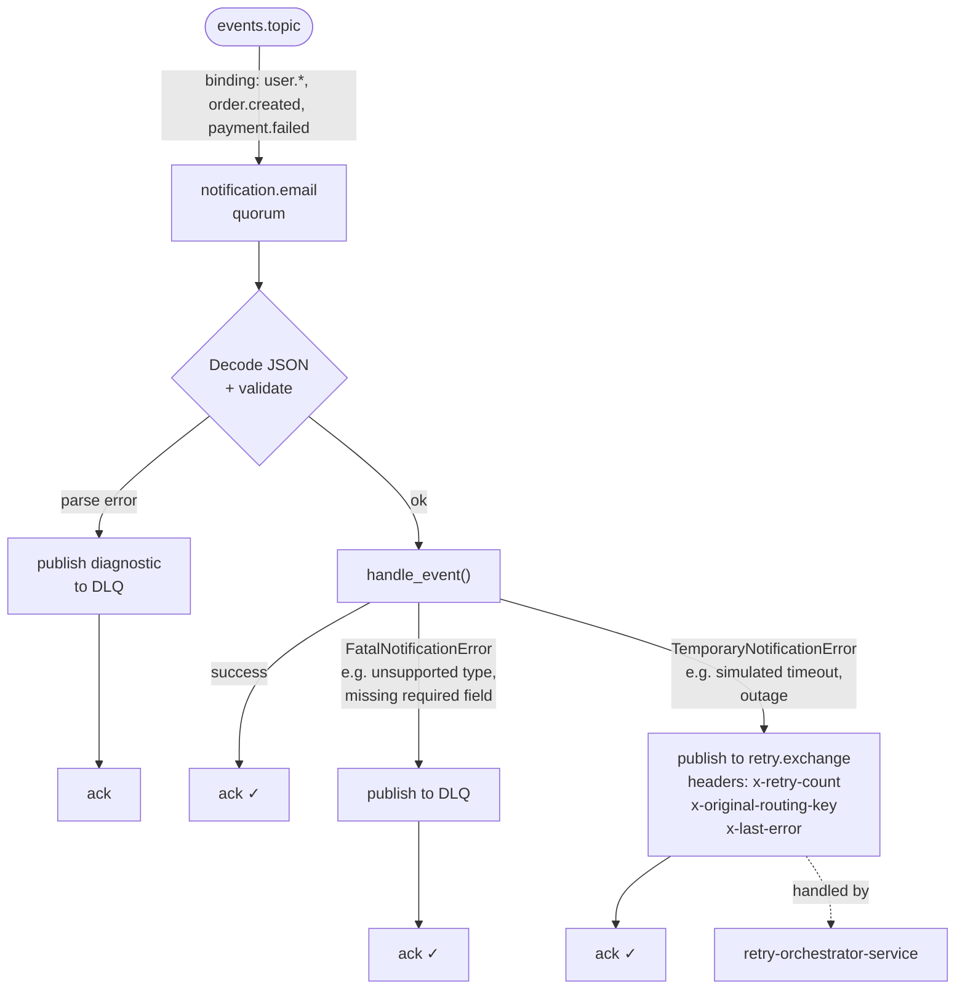
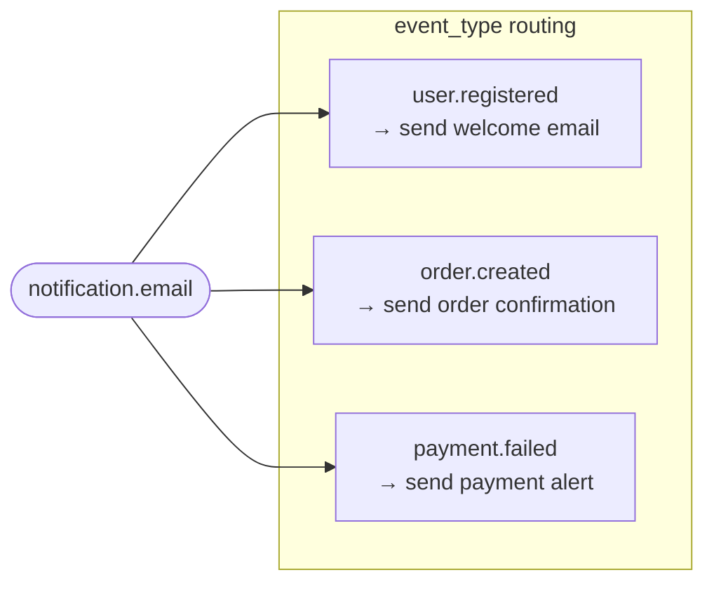

# event-platform-notification-service

Async **RabbitMQ consumer** for the event platform: subscribes to the events **topic** exchange, handles `user.registered`, `order.created`, and `payment.failed`, and routes failures to the shared **retry orchestrator** (`retry.exchange`) or **DLQ** (`TemporaryNotificationError` vs `FatalNotificationError`). Centralized retry limits and backoff live in [event-platform-retry-orchestrator-service](../event-platform-retry-orchestrator-service).

## Flow

**Path through this service (read left → right):** the broker routes matching events into **`notification.email`** (declared as a **quorum** queue); this process **then** decodes, runs `handle_event`, and on failure forwards to the retry path or DLQ. The next diagram is the full branching (not a left-to-right line).







## Repositories

[GitHub: Elena-sky](https://github.com/Elena-sky)

- [event-platform-gateway-api](https://github.com/Elena-sky/event-platform-gateway-api)
- [event-platform-notification-service](https://github.com/Elena-sky/event-platform-notification-service)
- [event-platform-analytics-audit-service](https://github.com/Elena-sky/event-platform-analytics-audit-service)
- [event-platform-retry-orchestrator-service](https://github.com/Elena-sky/event-platform-retry-orchestrator-service)
- [event-platform-infra](https://github.com/Elena-sky/event-platform-infra)

## Requirements

- **Python 3.12 or 3.13** (3.13 recommended). On **Python 3.14**, installing `pydantic-core` from `requirements.txt` often fails during build — use 3.12/3.13 or wait for wheels for your Python version.
- A running **RabbitMQ** instance (local or from [event-platform-infra](https://github.com/Elena-sky/event-platform-infra)).
- Exchange and queues must match the **gateway** topology (`events.topic` by default).

## Development

```bash
pip install -r requirements-dev.txt
ruff check app tests
ruff format app tests
pytest
```

**CI:** push/PR to `main` or `master` runs Ruff and pytest (see `.github/workflows/ci.yml`).

## Quick start

### 1. Infrastructure (RabbitMQ)

From the `event-platform-infra` directory:

```bash
docker compose up -d
```

Defaults: AMQP `localhost:5672`, user/password `admin` / `admin`, management UI: http://localhost:15672

### 2. Retry orchestrator (recommended before notification)

Declare and run the centralized retry pipeline so `retry.exchange` / delay topology exists and temporary failures can be delayed and re-published. From [event-platform-retry-orchestrator-service](../event-platform-retry-orchestrator-service):

```bash
cp .env.example .env   # align broker credentials and DLQ names with notification
docker compose up --build
```

### 3. Notification service (Docker)

From this repository:

```bash
cd event-platform-notification-service
cp .env.example .env
docker compose up --build
```

Compose sets `RABBITMQ_HOST=rabbitmq` on the container. Align `EVENT_PLATFORM_NETWORK_NAME` in `.env` with [event-platform-infra](https://github.com/Elena-sky/event-platform-infra) (same as [event-platform-gateway-api](https://github.com/Elena-sky/event-platform-gateway-api)).

### 4. Configuration (local `.env`)

```bash
cp .env.example .env
```

Edit `.env` as needed. **All variables** from `.env.example` must be set in `.env` or the environment — there are no fallbacks in code (`app/core/config.py`). `RABBITMQ_NOTIFICATION_BINDING_KEYS` is comma-separated (e.g. `user.*,order.created,payment.failed`). Retry routing uses `RABBITMQ_RETRY_EXCHANGE` + `RABBITMQ_RETRY_ROUTING_KEY` (must match the orchestrator ingress binding).

### 5. Virtual environment and dependencies

```bash
python3.13 -m venv .venv
source .venv/bin/activate   # Windows: .venv\Scripts\activate
pip install -r requirements.txt
```

### 6. Run locally (no Docker)

From the repository root:

```bash
python -m app.main
```

If RabbitMQ is unreachable, the process exits with an error.

## Failure handling (retry / DLQ)

- **Success** → `ack` on the main queue message.
- **`TemporaryNotificationError`** or unexpected errors → publish to **`retry.exchange`** (`RABBITMQ_RETRY_ROUTING_KEY`) with headers `x-retry-count` (current attempt counter), `x-original-routing-key`, `x-last-error`, then `ack`. The **retry orchestrator** applies backoff (TTL → `events.topic`), increments retry policy, and sends exhausted messages to the DLQ.
- **`FatalNotificationError`** (e.g. bad payload, unsupported `event_type`, missing `order_id` for `order.created`) → publish to DLQ, then `ack`.
- **Unparseable message body** (not JSON or not a JSON object) → publish a diagnostic record to DLQ (`raw_body`, `decode_error`, synthetic `event_id`), then `ack` — no silent drop.

**Manual checks** (with gateway on `http://localhost:8000`): run RabbitMQ, then **retry orchestrator**, then this service. Send `user.registered` with `payload.email`; send `payment.failed` with `payload.simulate_temporary_failure: true` to exercise orchestrator retries → DLQ after `MAX_RETRIES` on the orchestrator; send `payment.failed` without `email` for immediate DLQ. For `order.created`, include `order_id` in `payload` (required).
